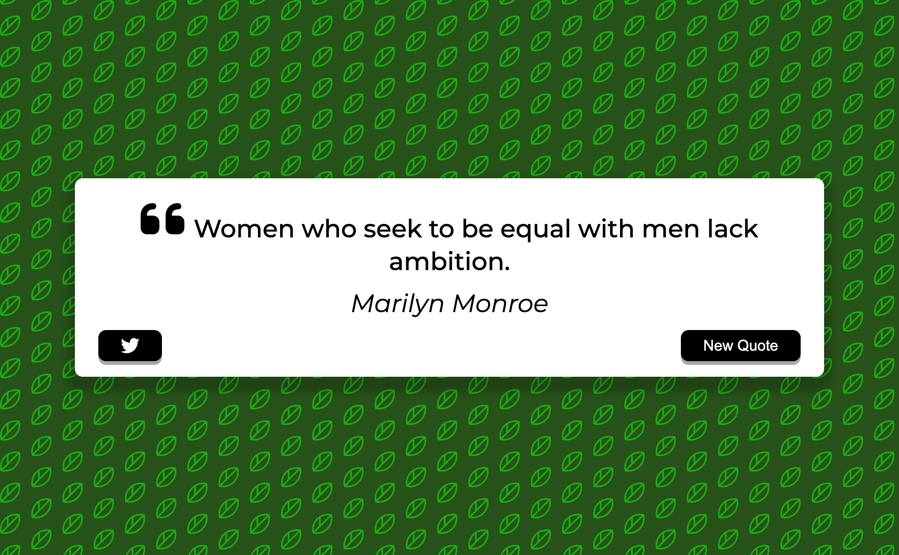
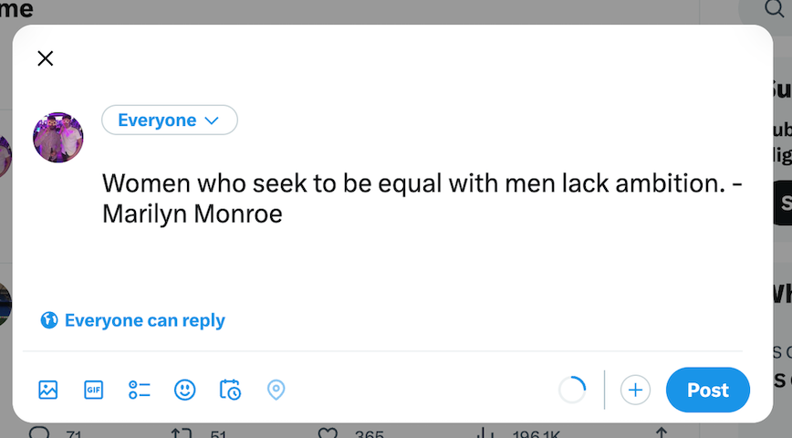

# Quote-Generator

## Purpose

This is a simple website that generates quotes at the click of a button using HTML, CSS and Javascript. The quote will be shown alongside the author of the quote. It also allows you to tweet any quotes that you resonate with or enjoy. I created this to practice working with web API's and to also practice manipulating DOM elements. 

`New Quote` button is used to generate new quotes.

`Twitter` button is used to tweet the current quote.

## Screenshot of Quote Generator

## Link to Deployed Website

https://rbcheung.github.io/Quote-Generator/